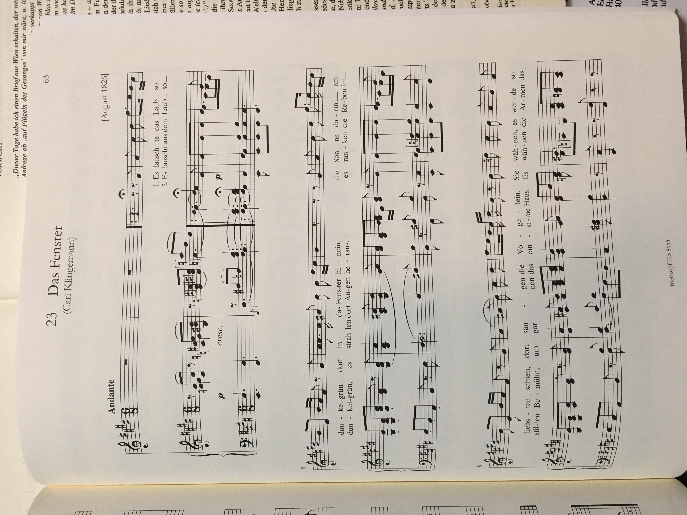
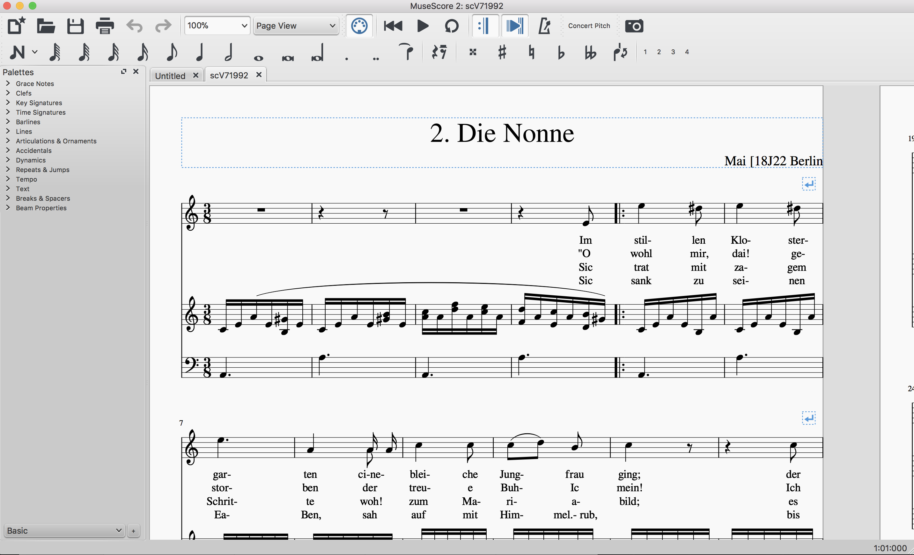
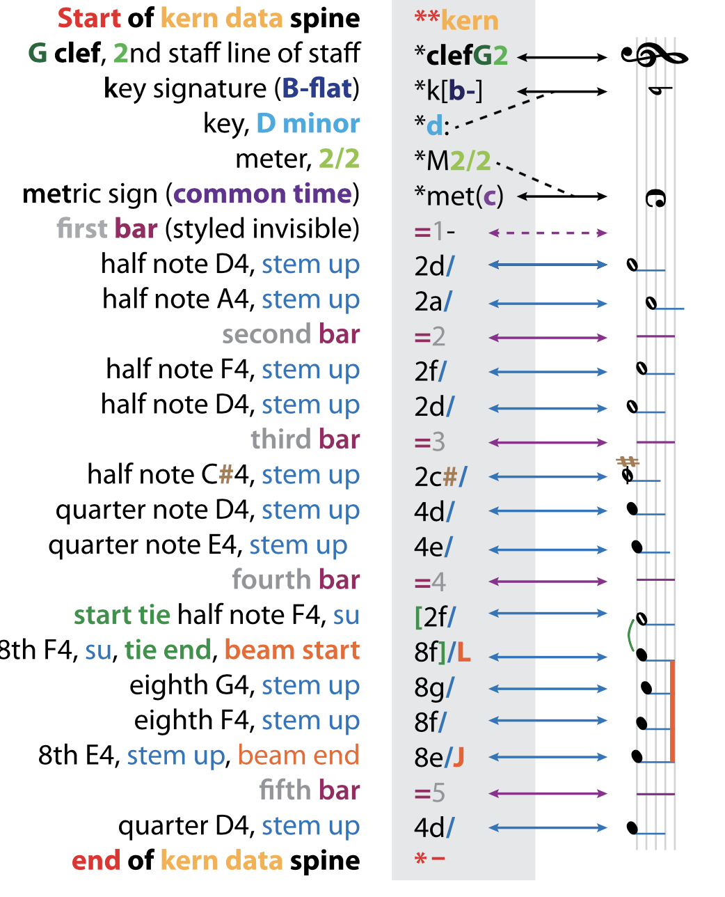

# About the data and conversion process

## Pieces used

The majority of the pieces used in this paper were lieder of Felix Mendelssohn and Fanny Hensel. While both composers composed different types of music, the majority of available scores from Fanny Hensel were lieder. Felix Mendelssohn composed many different styles of music, orchestral, piano, etc. Fanny Hensel in contrast has an available existing corpus of mostly lieder, although she did compose many works for solo piano and orchestra.  Of Felix's music there were a total of 116 pieces: lieder of Op 8 (12 pieces), op 9 (12 pieces), op 19(6 pieces), op 34 (6 pieces), op 47 (6 pieces), op 57 (6 pieces), op 71 (6 pieces), and 6 pieces of lied without opus numbers, also 56 lied without a collection. 

Of Fanny's music, a total of 43 pieces were used: 23 lieder were used from her lieder without name collection, 10 from her Wo kommst du Her collection, and 10 from an unnamed collection.

Data from JS Bach was also used. These data were available in Kern Score format. from the Center for Computer Assisted Research in the Humanities. (CCARH). The pieces used were from the Well Tempered Clavier (WTC). These were written as training pieces and each book contains 24 pieces with one in every possible key. These were chosen as the data were more easily accessible (no scanning was required), and they were a similar format as the Mendelssohn songs, written as for solo piano(or harpsichord).

```{r,out.width = "50%",echo = F,fig.cap = 'A picture of a score'}

```

## Optical music recognition

The vast majority of classical music is found solely in PDF or physical copies. Sheet music as a form of data requires a lengthy process of conversion before being able to be used in any analysis. Simply scanning the scores into, say, a PDF, gives no musical semantics and can only be viewed on screen or printed on paper. Thus, the two main steps in reading in data from sheet music are: using optical music recognition software to transform physical scores into digital formats, and second,to read the digital format in to R where subsequent analysis can be done. 

The scores used in this paper were obtained from physical copies available in the Reed music library. These scores were then scanned using software designed for optical music recognition (OMR). 
Optical music recognition requires learning from graphical and textual information. The main things the software must pick up are the locations of bar lines, notes, rests, slurs, dynamic markings, tempo markings, lyrics etc. Basic optical music recognition has been around since 1966. 

Most commonly, the first step in optical music recognition is to remove the staff lines. The staff lines are critical, as they define the basis for the vertical definition distance of pitch, and the horizontal distance definition of rhythm. The staff gives a normalization that is helpful, essentially defining the size of what notes and rhythm look like. Staff removal methods include projections, histograms, run lengths, candidates assemblage, contour tracking, and graph path search. [@OMR]

The next step is music symbol extraction and classification. These methods include template matching, where the object in question is compared to existing known musical symbols, simple operators, such as analysis of bounding boxes and projections, joining graphical primitives, such as combining extracted objects such as notes, note heads, and note beams to connect them in a musically correct way to form chords etc. Other methods use statistical models for analyzing musical primitives (the objects its trying to classify) such as Neural Networks, Support Vector Machines, k-Nearest Neighbor, and Hidden Markov Models.

The next step OMR preforms is syntactical analysis and validation. This step essentially uses defined grammars describing the organization of music notation in terms of music symbols. This makes the classification problem simpler, as there are existing rules and relationships between musical symbols. 

```{r, out.width = "400px", fig.cap = "A score in MuseScore format after being read by PhotoScore"}

```

The OMR used in this paper was Photo Score. Photo Score works by scanning the score on a flatbed scanner at a high resolution. It then uses OMR techniques to output a musicXML file that can be read in by most music composing software, such as Sibelius, Finale or Muse Score. MusicXML is commonly used as a format for digital music, as it is conducive to representing sheet music and music notation, and it can be transferable to many different music software. Muse Score was chosen to be the music software for viewing digital scores, as it is a free software that can read MusicXML.

After being scanned by PhotoScore and read into Muse Score, each piece was proof-read and corrected. This involves looking through every piece line by line for each bar to "spell check" the digital version. PhotoScore did a very impressive job recognizing notes, but often had issues recognizing rhythms. There were on average approximately 6 issues per piece. Unfortunately, the scanning process is very lengthy and time consuming, as the scanning often gives a large number of mistakes. Often the score must be then scanned again. In addition the proof-reading process is lengthy. We must check each note and theme for errors against the original score, and change the afflicted notes using Muse Score. The corrected score must then be output as a musicXML file. In addition, there were some pieces that PhotoScore had a hard time reading. These pieces were then entered into MuseScore by hand and then proofread. 

MusicXML on its own is not conducive to converting into a data frame as representing the single half note middle C looks like this: 

```{fig.cap = "Musicxml code for middle c"}
<?xml version="1.0" encoding="UTF-8" standalone="no"?>
<!DOCTYPE score-partwise PUBLIC
    "-//Recordare//DTD MusicXML 0.5 Partwise//EN"
    "http://www.musicxml.org/dtds/partwise.dtd">
<score-partwise>
  <part-list>
    <score-part id="P1">
      <part-name>Music</part-name>
    </score-part>
  </part-list>
  <part id="P1">
     <measure number="1">
      <attributes>
        <divisions>1</divisions>
        <key>
          <fifths>0</fifths>
        </key>
        <time>
          <beats>4</beats>
          <beat-type>4</beat-type>
        </time>
        <clef>
          <sign>G</sign>
          <line>2</line>
        </clef>
      </attributes>
      <note>
        <pitch>
          <step>C</step>
          <octave>4</octave>
        </pitch>
        <duration>4</duration>
        <type>whole</type>
      </note>
    </measure>
  </part>
</score-partwise> 
```  

We then need to convert into a format more easily readable into R. The Kern Score music format is much more easily readable. It has clearly expressed time signature, bar, beat and musical voicing information [@mearns2010](mearns). Because of this, it is also more conducive to being read into an R data frame. 
 The below picture shows how a basic piece of music corresponds to a .krn file. 


```{r,out.width = "50%",echo = F,fig.cap = 'How sheet music corresponds to kern files'}

```

Kern files are organized with columns each representing one line of music. Each line of a Kern file represents one note of one value of a time base. The time base for a Kern file is based on the smallest (shortest) rhythm value of a note found in a piece. For example, if a piece was in 4/4 and there were sixteenth notes present there would be 16*4 rows for each measure. The "attack" of each note is the only note printed, the following time while the note is held is represented with dots in the remaining rows until a new note is sounded for that staff. The pitch of each note is represented by the letters a through g. The case (lower or upper) as well as the repetition (c or ccc) represents which octave the pitch occurs. Any accidental is represented with a #, -, or n symbol. Each instrument/staff in a piece is represented using one (or more) columns called splines. For example, in most Lied, there is voice and piano. There are thus three splines, one for voice, one for the treble clef staff of the piano, and one for the bass clef of the piano. In addition, there are splines that contain the text for the voice for the corresponding notes. This was not of interest to the musical classification problem, so these splines were removed. Chords are represented by multiple notes on the same line. For example, if there was a half note C major triad followed by a quarter note D flat, it would be represented as 

```{}
2c 2e 2g
4d- . . 
```

In addition, there is a lot of information about the appearance of the piece, stem direction etc for notes, but this was decided as not important for determining style, so it was removed.

We convert to .krn format by using Humdrum's function xml2hum that converts a musicXML file into a .krn file. Humdrum is a computational music software used to analyze music. It is a command line tool that has many functions for music analysis. The Kern file type can be read much more easily into R. Compared to above, the code for a single middle c whole note would be :

```{}
**kern
*clefG2
*k[c]
*M4/4
=1-
1c/
```

The import_xml_files.sh file goes through the process of converting scores from musicXML to .krn. Each spline needs to to be individually converted using xml2hum. The individual splines are then converted into the same time base (there are issues when the bass line only has half notes and the soprano line has a lot of 32nds). This conversion essentially adds dots as placements so that the splines can line up correctly by measure and beat. 

The CCARH has a large data base mainly baroque and Renaissance composers already in the Kern format, which is where the Bach data came from.  The files that were scanned need to be separated into having a separate file for each staff, which would mean a seperate file for each instrument. In addition, since we are focused on musical style, the text of the pieces are removed in this stage. In our case for each piece there are always two or three files for each piece, which are voice, piano right hand, and piano left hand. This is necessary to avoid the bugs in xml2hum that have issues when staffs don't necessarily match up as a result of the conversion process, most often by rhythm.

## .krn to R

Once we have .krn files to represent each piece we use regular expressions to extract key information. For scanned music (Felix and Fanny music), there are as many files are there are staffs, usually three. MuseR's `krn2df()` and `piece_df()` functions read in .krn files and output a data frame in R for each piece. First the data in .krn format are read in line by line using R's `readLines()` function. This takes every line of the .krn file and converts it into a vector. Each entry contains the rythem value and note value for all notes in that line. If there are multiple notes played at the same time, they are all in one line. The notes are separated by splitting up the string by spaces. This converts a single string representing one Kern line to multiple strings each representing one note (or dot placeholder) for one Kern line. Then each entry is separated out into the theme and note value for each note. Each line contains the following columns: the measure the note occurs in, the rhythm value for the (for example 4), note name, octave inclusive (for example cc), note name (octave exclusive)[ C sharp]. In addition, for the whole piece the key signature and meter are recorded as columns. If there are 3 splines and each spline has at most one note at a time, there would thus be $3 + 3*3=12$. If there are 3 splines and one of the splines has at most 3 values, that is equivalent to having 5 total splines there are then $ 3 + 3*5 = 18$ columns. 

A lot of data included in the .krn files are not necessary. For example, we assume that whether or not a note has a step up or stem down offers no help in classifying composer style, so this information is removed when converting to an R data frame. 

Inspired by the .krn file type, each row of the R data frame contains one time base value. For a given piece, the time base represents the shortest note duration value. For example, if the shortest note a piece contained was a sixteenth note, the time base would be 16. Each measure then would contain 16 rows. This results in many rows of NA for certain instruments, when a note is still being voiced, but it is not the instance of the note being attacked. 


