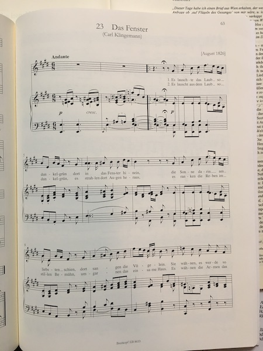

# About the data and conversion process

## Pieces used
The majority of the pieces used in this paper were Lieder of Felix Mendelssohn and Fanny Hensel. While both composers composed different types of music, the majority of available scores from Fanny Hensel were Lieder. Felix Mendelssohn composed many different styles of music, orchestral, piano, etc. Fanny Hensel in contrast has an available existing corpus of mostly Lieder, although she did compose many works for solo piano and orchestra.  Of Felix's music, 
Lieder of Op 8 (12), op 9 (12), op 19(6), op 34 (6), op 47 (6), op 57 (6), op 71 (6), and 6 pieces of Lied without opus numbers, also 56 lied without a collection. A total of 116 pieces. 

Of Fanny's music, 23 lieder were used from her Lieder without Name collection, 10 from her wo kommst du her collection, and 10 from, a total of 43 pieces. 

Data from JS Bach was also used. These data were available in Kern Score format. from the Center for Computer Assisted Research in the Humanities. (CCARH). The pieces used were the Well tempered clavier. These were written as training pieces and each book contains 24 pieces with one in every possible key. These were chosen as the data were more easily accessible (no scanning was required), and they were a similar format as the Mendelssohn songs, written as for solo piano(or harpsichord).

```{r,fig.height=1,echo = F,fig.cap = 'A picture of a score'}

```

## Optical music recognition

The vast majority of classical music is found solely in PDF or physical copies. Sheet music as a form of data requires a lengthy process of conversion before being able to be used in any analysis. Simply scanning the scores into, say, a PDF, gives no musical semantics and can only be viewed on screen or printed on paper. Thus, the two main steps in reading in data from sheet music are: using optical music recognition software to transform physical scores into digital formats, and to read the digital format in to R where subsequent analysis can be done. 

The scores used in this paper were obtained from physical copies available in the Reed music library. These scores were then scanned using software designed for optical music recognition (OMR). 

Optical music recognition requires learning from graphical and textual information. The main things the software must pick up are the locations of bar lines, notes, rests, slurs, dynamic markings, tempo markings, lyrics etc. Basic optical music recognition has been around since 1966. 

Most commonly, the first step in optical music recognition is to remove the staff lines. The staff lines are critical, as they define the basis for the vertical definition distance of pitch, and the horizontal distance definition of rhythm. The staff gives a normalization that is helpful, essentially defining the size of what notes and rhythm look like. Staff removal methods include projections, histograms, run lengths, Candidates assemblage, contour tracking, and Graph path search. [@OMR]

The next step is music symbol extraction and classification. These methods include template matching, where the object in question is compared to existing known musical symbols, simple operators, such as analysis of bounding boxes and projections, joining graphical primitives, such as combining extracted objects such as notes, note heads, and note beams to connect them in a musically correct way to form chords etc. Other methods use statistical models for analyzing musical primitives (the objects its trying to classify) such as Neural Networks, Support Vector Machines, k-Nearest Neighbor, and Hidden Markov Models.

The next step OMR preforms is syntactical analysis and validation. This step essentially uses defined grammars describing the organization of music notation in terms of music symbols. This makes the classification problem simpler, as there are existing rules and relationships between musical symbols. 

```{r, out.width = "400px"}

```

The OMR used in this paper was Photo Score. Photo Score works by scanning the score on a flatbed scanner at a high resolution. It then uses OMR techniques to output a musicXML file that can be read in by most music composing software, such as Sibelius, Finale or Muse Score. MusicXML is used commonly as a format for digital music, as it is conducive to representing sheet music and music notation, and it can be transferable to many different music software. Muse Score was chosen to be the music software for viewing digital scores, as it is a free software that can read MusicXML. After being read into Muse Score, each piece was proof-read and corrected, as there were often errors in the OMR, especially in recognizing triplets. Unfortunately, the scanning process is very lengthy and time consuming, as the scanning often gives a large number of mistakes. The score must be then scanned again. In addition the proof-reading process is lengthy. We must check each note and theme for errors against the original score, and change the afflicted notes using Muse Score. The corrected score must then be output as a musicXML file. 


MusicXML on its own is not conducive to converting into a data frame as representing the single half note middle C looks like this: 

\newpage
```{}
<?xml version="1.0" encoding="UTF-8" standalone="no"?>
<!DOCTYPE score-partwise PUBLIC
    "-//Recordare//DTD MusicXML 0.5 Partwise//EN"
    "http://www.musicxml.org/dtds/partwise.dtd">
<score-partwise>
  <part-list>
    <score-part id="P1">
      <part-name>Music</part-name>
    </score-part>
  </part-list>
  <part id="P1">
     <measure number="1">
      <attributes>
        <divisions>1</divisions>
        <key>
          <fifths>0</fifths>
        </key>
        <time>
          <beats>4</beats>
          <beat-type>4</beat-type>
        </time>
        <clef>
          <sign>G</sign>
          <line>2</line>
        </clef>
      </attributes>
      <note>
        <pitch>
          <step>C</step>
          <octave>4</octave>
        </pitch>
        <duration>4</duration>
        <type>whole</type>
      </note>
    </measure>
  </part>
</score-partwise> 
```  

We then need to convert into a format more easily readable into R. The Kern Score music format is much more easily readable. It has clearly expressed time signature, bar, beat and musical voicing informations [@mearns2010](mearns)
 The below picture shows how a basic piece of music corresponds to a .krn file. 


Each line of a krn file represents one value of a timebase. Kern files are based on the smallest (shortest) rhythm value of a note found in a piece. For example, if a piece was in 4/4 and there were sixteenth notes present there would be 16*4 rows for each measure. The "attack" of each note is the only note printed, the following time while the note is held is represented with dots in the remaining rows until a new note is sounded for that staff. 

We do this by using Humdrum's function xml2hum that converts a musicXML file into a .krn file. Humdrum is a computational music software. It is a command line tool that has many functions for music analysis. The kern file type can be read much more easily into R. Compared to above, the code for a single middle c whole note would be :

```{}
**kern
*clefG2
*k[c]
*M4/4
=1-
1c/
```

Each staff of a piece of music corresponds to one .krn spline. Each spline is represented in a column. The lowest bass staff is the first column and then progresses up to a soprano line. 

The import_xml_files.sh file goes through the process of converting scores from musicXML to .krn. The CCARH has a large data base mainly baroque and Renaissance composers already in this format, which is where the Bach data came from.  The files that were scanned need to be separated into having a separate file for each staff, which would mean a seperate file for each instrument. In addition, since we are focused on musical style, the text of the pieces are removed in this stage. In our case for each piece there are always two or three files for each piece, which are voice, piano right hand, and piano left hand. This is necessary to avoid the bugs in xml2hum that have issues when staffs don't necessarily match up as a result of the conversion process, most often by rhythm.

## .krn to R

Once we have .krn files to represent each piece we use regular expressions to extract key information. For scanned music (Felix and Fanny music), there are as many files are there are staffs, usually three. MuseR's `krn2df()` and `piece_df()` functions read in .krn files and output a data frame in R for each piece. First the data in .krn format are read in line by line using R's `readLines()` function. This takes every line of the .krn file and converts it into a vector. Each entry contains the rythem value and note value. If there are multiple notes played at the same time, they are all in one line. Then each entry is seperated out into the rythem and note value for each note. Each line contains the following columns: measure, rhythm value [4], rhythm name [quarter note], note value [5], note name (octave inclusive)[cc], note name (octave exclusive)[ C sharp]. In addition, for the whole piece the key signature and meter are recorded as columns. 

A lot of data included in the .krn files are not necessary. For example, we assume that whether or not a note has a step up or stem down offers no help in classifying composer style, so this information is removed when converting to an R data frame. 

Inspired by the .krn file type, each row of the data frame contains one time base value. For a given piece, the time base represents the shortest note duration value. For example, if the shortest note a piece contained was a sixteenth note, the time base would be 16. Each measure then would contain 16 rows. This results in many rows of NA for certain instruments, when a note is still being voiced, but it is not the instance of the note being attacked. 

## rules of counterpoint?
First species: 
Note against note: both parts contain notes of same duration.
Begin and end on a perfect consonance (PC). Consonant intervals only between the voices.
No parallel perfect consonances.
From one PC to another PC, proceed in contrary or oblique motion.
From a PC to an IC, proceed in any motion. From an IC to a PC, proceed in contrary or oblique motion.
From IC to IC, proceed in any motion.

## About the functions - MuseR

Once the scores are converted into R raw data, feature creation begins. These features are mostly features suggested by John Cox. 

To the best of my knowledge, there is currently no package of R that has been built to analyze sheet music. There are existing packages (such as tuneR) that examine audio formats of music. The intention of this thesis was to create a package, museR, that takes sheet music in the proper form (musicXML or .krn) and does all of the analysis using R. 

#### Melodic intervals

Melodic intervals, or the interval between two succesive notes, are found using the `mel_ints()` function. This first calculates the top line of any instrument.

\begin{abc}[name=c-dur]
X: 1 % start of header
K: C % scale: C major
C4 G4 | (3FED c4 G2 |
\end{abc}

This outputs the proportion of each melodic interval happening over the whole piece. 

Similarly the `connsonance()` function outputs the proportion of consonant (perfect, imperfect, dissonant) intervals over the whole piece by calling `mel_ints()`. 

#### Major_minor

For most musical analysis, the key of the piece is important in determining chords, etc. The key is based on the key signature, which is always given in a .krn file. Kern files from CCARH have the key of the piece given, but 


#### Chords

Suspended chords are currently not supported by MuseR. Chords that begin, or are "attacked" at the same time count. 

First, the key of the piece is found, as differnet chords depend on the key. (really?)

Next, the times notes are played at the same time are extracted into a list. Then the number of unique notes played at once is found. If there are two notes played at once, `harm_int()` calculates the harmonic interval. This is done by calculating $$note_1 - note_2 \mod(12)$$ This gives the number of half steps between each note. That number is then matched with the index of the interval. Work is being done to have this include augmented and diminished interval, but unfortunately that has not been completed at this time. 

The possible triad chords are all defined by the intervals between each note. For example, a Major triad is given by the base note, a major third above the base, and a perfect fifth above the base. This corresponds to 4 half steps then 4 half steps. Alternatively a minor triad is given by the base, a minor third above, and a perfect fifth aboe the base, which is 3 half steps, then 5 half steps. 

A similar process is done for seventh chords. 


#### Resolutions


#### Density


#### Par thirds, par fourths, par sixths


#### Prop scale degree


