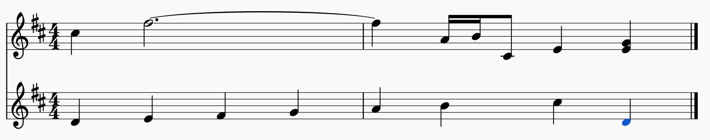
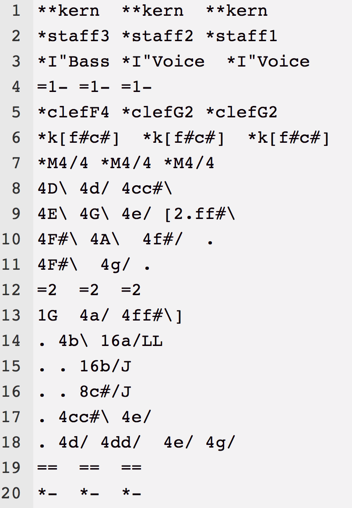
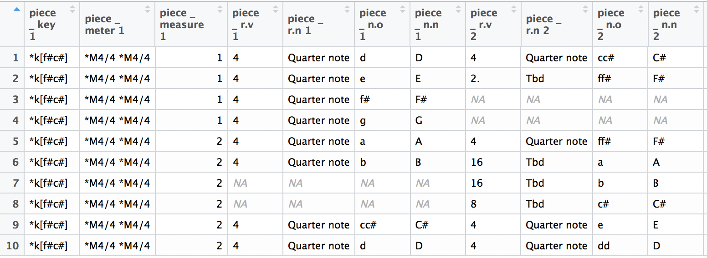
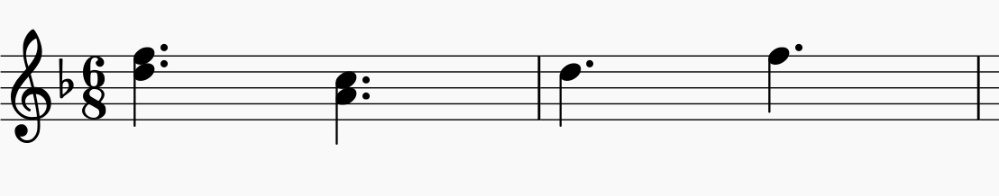

# MuseR and features


To the best of my knowledge, there is currently no package of R that has been built to analyze sheet music. There are existing packages (such as tuneR) that examine audio formats of music. The intention of this thesis was to create a package, museR, that takes sheet music in the proper form (musicXML or .krn) and does all of the analysis using R. 

## Reading in data

MuseR is equipped to take in data in the .krn format. The functions for this are `kern2df()` and `piece_df()` These are most usefully in the form of individual splines. This allows for naming the columns according to instrument. If the following piece is represented in .krn format by 

```{r,out.width = "50%", echo = F}


```

`piece_df()` outputs the following data frame
```{r,out.width = "75%", echo = F}

```

#### Melodic intervals

Melodic intervals, or the interval between two successive notes, are found using the `mel_ints()` function. This first calculates the top line of any instrument.
This then outputs the proportion of each melodic interval happening over the whole piece. There are 12 possible intervals that are counted (ignoring augmented and diminished): unison,m2,M2,m3,M3,p4,tt,p5,m6,M6,m7,M7. `mel_ints()` outputs a vector of the proportion of each of the intervals. 

```{r,echo = F}

```

For example if this function was run on the above piece, the melodic top line intervals would be: $\{(f,c),(c,d),(d,f)\} = \{p4,M2,m3\}$, which would output a proportion of: $(0,1/3,1/3,0,0,1/3,0,0,0,0,0,0)$

Similarly the `connsonance()` function outputs the proportion of consonant (perfect, imperfect, dissonant) intervals over the whole piece by calling `mel_ints()`. 

#### Density

#### Major_minor

For most musical analysis, the key of the piece is important in determining chords, etc. The key is based on the key signature, which is always given in a .krn file. Kern files from CCARH have the key of the piece given, but scanned files do not. 
For kern files from CCARH, `Major_minor()` extracts the key given by the .krn file. for scanned files, `Major_minor()` identifies the two options for key given the key signature. For example, if there was a key signature with one sharp, the options would be G Major or E minor. The tonic for each option is identified, and then the count of instances of both choices for tonic is made. The key is determined by which of the options for tonic has the higher count. When this was tested on the WTC pieces, it correctly classified x/48 of them. 
(I think I should add some weighting for the first and last note in the future.. )

#### Prop scale degree

#### Chords

Suspended chords are currently not supported by MuseR. Chords that begin, or are "attacked" at the same time count. 

First, the key of the piece is found, as different chords depend on the key. 

Next, the times notes are played at the same time are extracted into a list. Then the number of unique notes played at once is found. If there are two notes played at once, `harm_int()` calculates the harmonic interval. This is done by calculating $$note_1 - note_2 \mod(12)$$ This gives the number of half steps between each note. That number is then matched with the index of the interval. Work is being done to have this include augmented and diminished interval, but unfortunately that has not been completed at this time. 

The possible triad chords are all defined by the intervals between each note. For example, a Major triad is given by the base note, a major third above the base, and a perfect fifth above the base. This corresponds to 4 half steps then 4 half steps. Alternatively a minor triad is given by the base, a minor third above, and a perfect fifth above the base, which is 3 half steps, then 5 half steps. 

A similar process is done for seventh chords. 

#### Resolutions

#### Par thirds, par fourths, par sixths


