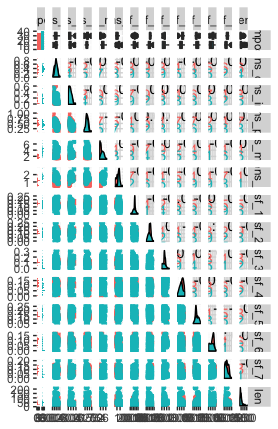
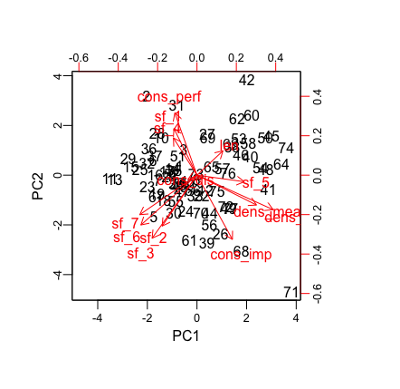
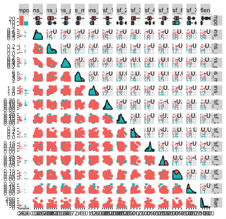
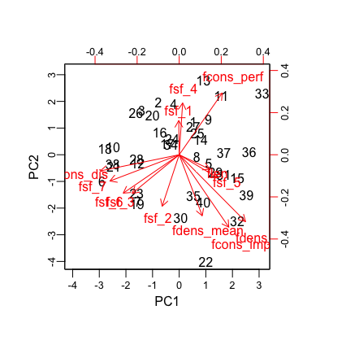
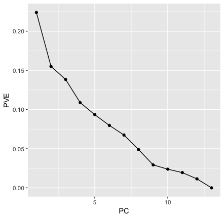

# EDA and Feature Selection

## Bach and Mendelssohns

Below are the pairwise distributions of each of the features used for Bach and the Mendelssohns. There are higher correlations between scale degree frequencies 3 and 6. There is also a surprising separation between the composers for the mean density. 

```{r,echo = F,fig.cap = 'Pairs plot'}

```
 
```{r,echo = F,fig.cap = 'PCA'}

```

As we can see from the above biplot, it seems like the second principal component encodes a sense of pleasant consonances. We have perfect consonances and frequencies of first and fourth scale degrees grouped together. 

## Felix and Fanny

```{r,echo = F,fig.cap = 'Felix/Fanny Correlations'}

```

We can see from the above pairwise distribution plot that we still have a high correlation between scale degrees 3 and 6. However we do not see the difference in beat density. This is likely due to the fact that fanny and Felix data set is composed of the same type of song, whereas the Bach data set is only solo piano music.   

```{r,echo = F,fig.cap = 'PCA felix/fanny'}

```


```{r,echo = F,fig.cap = 'Felix/Fanny skree plot'}

```


