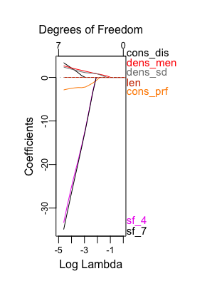
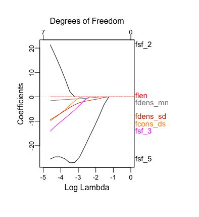

# Model Fit

## Model Fit - Bach/Mendelssohn

#### Logistic Regression

When a lasso logistic classifier was fit, we got a mean standard error (MSE) of 0.154. We see that the density features stayed in the longest.

```{r,echo = F,fig.cap = 'Lasso Bach/Mendelssohn'}

```

#### LDA
For linear discriminant analysis, we have a 5-fold cross validated MSE of 0.1558.

Most commonly our models incorrectly predict Mendelssohn songs to be composed by Bach. 


## Model fit Felix/Fanny

#### Logistic regression
When a lasso classifier was fit, we got a MSE of 0.35. We see that the density features and fifth scale degree stayed in the longest.

```{r,echo = F,fig.cap = 'Lasso Fanny/Felix'}

```
  

  